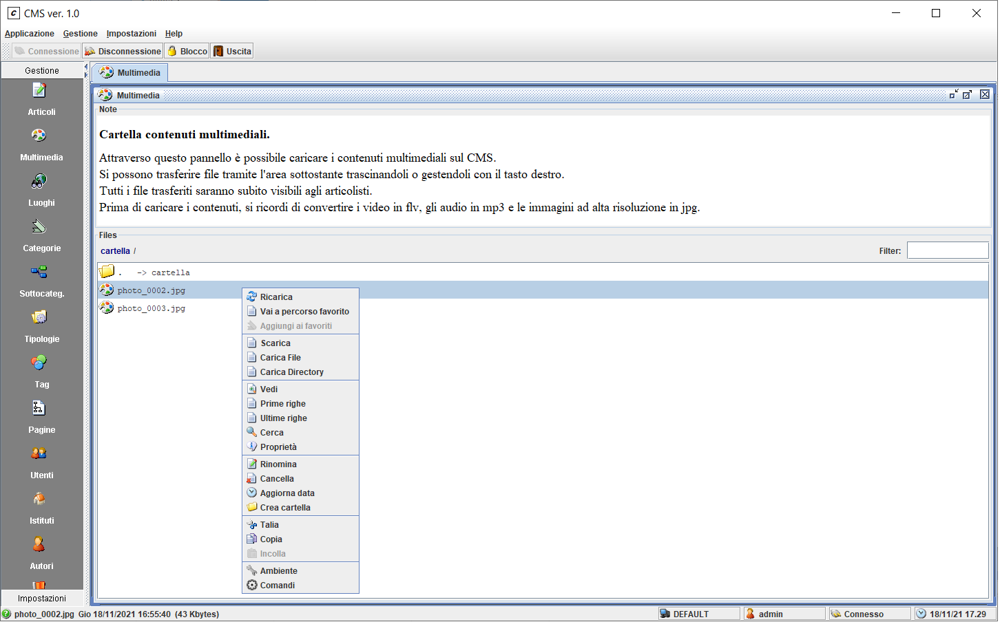
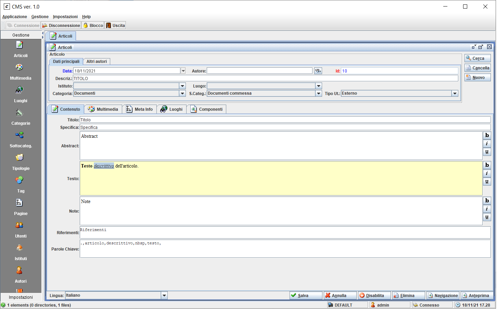
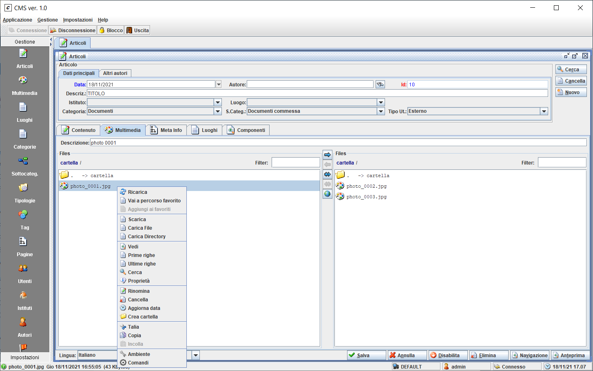

# CMS

A simple Content Management System.

This repository contains only the engine and the tool (see gui folder) for management.

## Dependencies

**multi-rpc 2.0.0**

- `git clone https://github.com/giosil/multi-rpc.git` 
- `mvn clean install` - this will publish `multi-rpc-2.0.0.jar` in Maven local repository

## Build

- `git clone https://github.com/giosil/cms.git`
- `mvn clean install`

## Example

```jsp
<%@ page import="java.util.*, org.dew.cms.*" %>
<%
  List<List<Object>> categories = CMS.getCategories();
  
  List<Article> articles = null;
  int category = WU.getCategoryPar(request);
  if(category != 0) {
    // Find article by category
    articles = CMS.find(category, 0);
  }
  else {
    articles = new ArrayList<Article>();
  }
%>
<!DOCTYPE html>
<html>
  <head>
    <title>CMS</title>
  </head>
  <body>
    <h3>CMS</h3>
    <h4>Categories:</h4>
    <% 
      for(int i = 0; i < categories.size(); i++) {
        List<Object> item = categories.get(i);
        out.println("<a href=\"index.jsp?" + CMS.PAR_CATEGORY + "=" + item.get(0) + "\">" + item.get(1) + "</a><br />");
      }
    %>
    <h4>Articles by category (<%= category %>):</h4>
    <% 
      for(int i = 0; i < articles.size(); i++) {
        Article article = articles.get(i);
        out.println(article.getTitle() + "<br />");
      }
    %>
  </body>
</html>
```

## Run Management Tool (org.dew.swingup.main.Main) from CMS-gui (see gui folder) sub-project

Default credentials: admin / admin

### Multimedia



### Articles



### Multimedia articles



## Contributors

* [Giorgio Silvestris](https://github.com/giosil)
