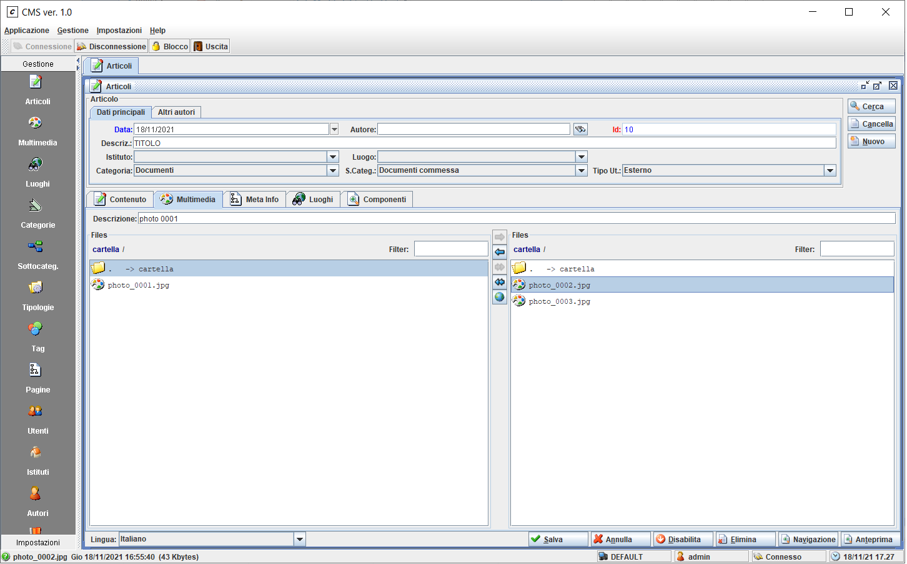

# CMS

A simple Content Management System.

This repository contains only the engine and the tool (see gui folder) for management.

## Run Management Tool (org.dew.swingup.main.Main) from CMS-gui (see gui folder) sub-project

Default credentials: admin / admin.

### Multimedia

### Articles

### Multimedia articles

## Build

- `git clone https://github.com/giosil/cms.git`
- `mvn clean install`

## Contributors

* [Giorgio Silvestris](https://github.com/giosil)
